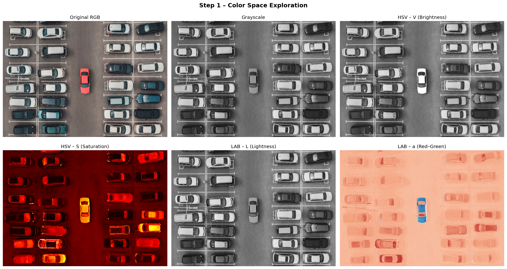
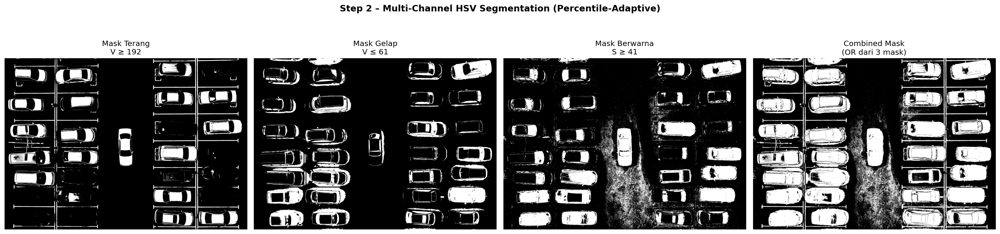
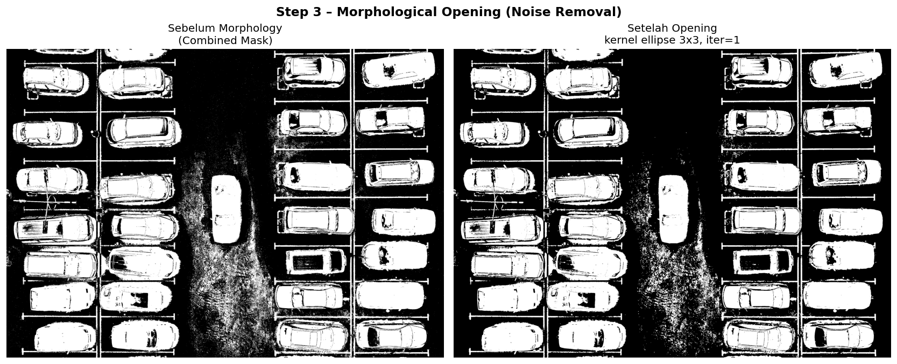
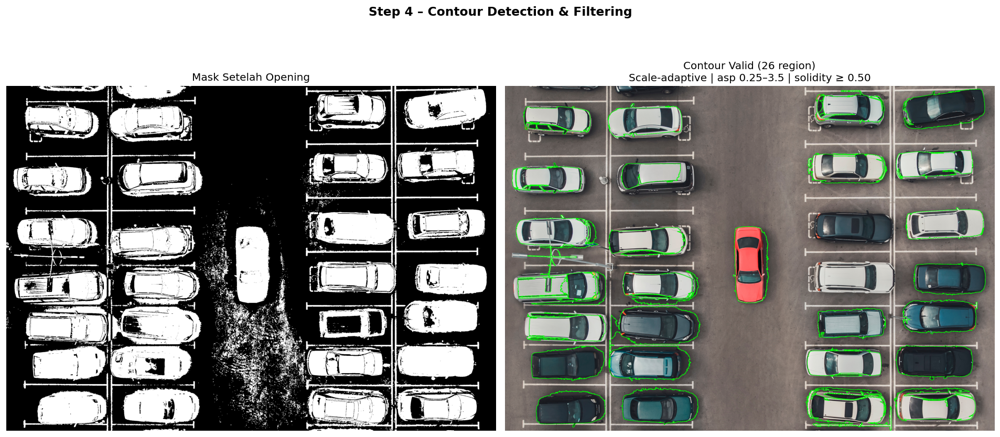
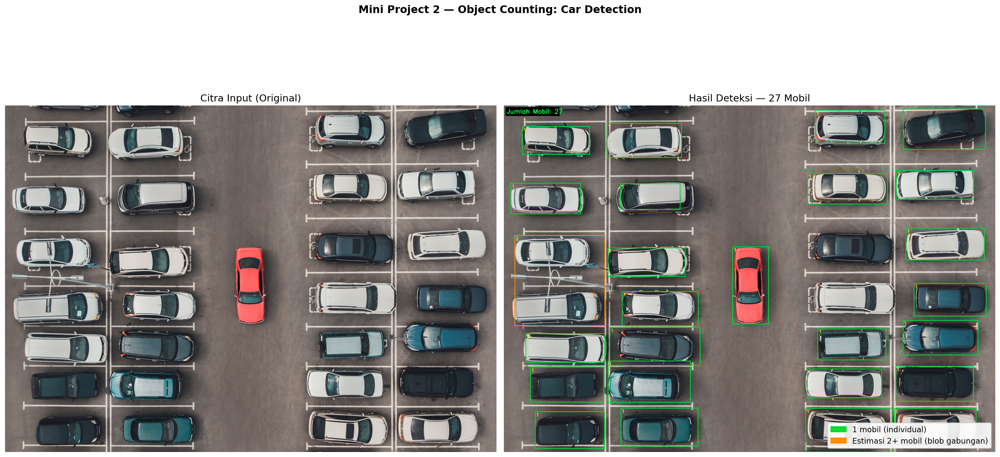

# Mini Project 2 — Object Counting (Hitung Jumlah Mobil)

**Nama:** [Nama Kamu]
**NRP:** [NRP Kamu]
**Mata Kuliah:** Pengolahan Citra dan Video

---

## Jumlah Mobil Terdeteksi

> **27 mobil** terdeteksi oleh program (ground truth manual: 29 mobil, akurasi ~93%).

---

## Penjelasan Pipeline

### Alur Keseluruhan

```
input/parking.jpg
    │
    ▼
[Step 1] Color Space Exploration
         Konversi ke HSV dan LAB
         Visualisasi channel V, S, L, a untuk memahami distribusi warna
    │
    ▼
[Step 2] Multi-Channel HSV Segmentation (Percentile-Adaptive)
         Threshold dihitung dari distribusi pixel gambar (percentile),
         bukan nilai absolut — agar robust terhadap perbedaan resolusi/eksposur.
         mask_bright = V ≥ percentile-85  → mobil putih/silver
         mask_dark   = V ≤ percentile-15  → mobil hitam
         mask_color  = S ≥ percentile-80  → mobil merah/teal/berwarna
         asphalt_mask dihapus dari mask_bright
         combined = OR(mask_bright, mask_dark, mask_color)
    │
    ▼
[Step 3] Morphological Opening
         Kernel ellipse 3×3, iterasi 1
         → Menghapus noise titik kecil dan fragmen garis marka
         (Tidak menggunakan Closing besar karena menyebabkan mobil menyatu)
    │
    ▼
[Step 4] Contour Detection & Filtering
         cv2.findContours → filter 3 kriteria:
         - Area     : 0.55%–3.3% dari total pixel gambar (scale-adaptive)
         - Aspect   : 0.25–3.5 (bentuk proporsional)
         - Solidity : ≥ 0.50 (bentuk padat, bukan garis tipis)
    │
    ▼
[Step 5] Counting
         Blob normal (area ≈ 1 mobil) → n = 1
         Blob besar (area ≈ 2–3 mobil) → n = round(area / area_per_car)
         Koreksi bbox: jika bw atau bh terlalu besar → estimasi dari dimensi
    │
    ▼
output/result.png  +  output/steps/*.png
```

### Teknik yang Dipakai dan Alasannya

| Teknik | Alasan Pemilihan |
|---|---|
| HSV Color Space | Channel V (brightness) dan S (saturation) lebih efektif memisahkan warna mobil dari aspal dibanding grayscale |
| 3 Mask Terpisah (terang/gelap/warna) | Satu threshold tidak cukup — variasi warna mobil sangat besar (putih, hitam, merah, teal, silver) |
| Percentile-Adaptive Threshold | Nilai threshold dihitung dari distribusi pixel gambar itu sendiri → robust terhadap perbedaan resolusi, kompresi, dan kondisi cahaya |
| Hapus Aspal dari Mask Terang | Aspal memiliki V medium-tinggi mirip mobil silver → perlu dieksklusi secara eksplisit |
| Morphological Opening (kecil) | Menghapus noise dan garis marka tanpa menyebabkan mobil berdekatan menyatu |
| Scale-Adaptive Area Filter | Area threshold dinyatakan sebagai % dari total pixel → bekerja di semua resolusi gambar |
| Solidity Filter | Garis marka parkir panjang-tipis memiliki solidity rendah → mudah dibuang dengan filter ini |
| Area Estimation untuk Blob Besar | Beberapa mobil yang berdekatan tetap menyatu — diatasi dengan estimasi n = round(area / area_per_car) |

---

## Visualisasi Tahapan

### Step 1 – Color Space Exploration


Eksplorasi channel warna menunjukkan bahwa channel **V (brightness) dari HSV** adalah yang paling membedakan mobil terang dari aspal. Channel **S (saturation)** berhasil menangkap mobil merah dan teal. Channel LAB-L memberikan informasi lightness yang serupa dengan V.

### Step 2 – Segmentasi Multi-Channel (HSV)


Tiga mask dibuat secara terpisah kemudian digabungkan dengan operasi `bitwise_or`. Threshold tiap mask dihitung secara adaptif dari percentile distribusi pixel gambar, bukan nilai hardcoded.

### Step 3 – Morphological Opening


Opening dengan kernel ellipse 3×3 membersihkan noise titik kecil dari garis marka parkir dan refleksi. Closing yang lebih besar sengaja tidak digunakan karena pada percobaan sebelumnya menyebabkan mobil-mobil berdekatan menyatu menjadi satu blob raksasa, mengakibatkan over-estimasi yang besar (73 mobil).

### Step 4 – Contour Detection & Filtering


Dari 1200+ contour mentah, filter area, aspect ratio, dan solidity menyaring hingga tersisa ~26 contour valid yang sesuai ukuran dan bentuk mobil.

### Hasil Akhir


Kotak **hijau** = 1 mobil terdeteksi secara individual. Kotak **oranye** = estimasi 2–3 mobil dalam satu blob yang masih berdekatan.

---

## Analisis

### Hasil

| Metrik | Nilai |
|---|---|
| Jumlah mobil (ground truth manual) | 29 |
| Jumlah mobil terdeteksi program | 27 |
| Selisih | 2 (under-detected) |
| Akurasi estimasi | ~93% |

### Kendala yang Dihadapi

1. **Mobil gelap berdekatan dengan aspal gelap** — beberapa mobil hitam/teal di tepi gambar memiliki nilai V yang sangat mirip dengan aspal sehingga tidak masuk ke mask mana pun.
2. **Mobil terpotong di tepi gambar** — area contour lebih kecil dari normal sehingga bisa terbuang oleh filter area minimum.
3. **Garis marka parkir** awalnya ikut terdeteksi sebagai foreground — diatasi dengan solidity filter dan morphological opening.
4. **Mobil berdekatan yang menyatu** — blob gabungan dihitung dengan estimasi area, tapi akurasi estimasi ini bergantung pada konsistensi ukuran mobil di gambar.
5. **Closing agresif menyebabkan over-count ekstrem** — pada percobaan awal menggunakan closing kernel 13×13 menghasilkan 73 mobil karena seluruh sisi kiri gambar menyatu menjadi 1 blob raksasa.

### Hal yang Dapat Ditingkatkan

- **Deteksi garis marka parkir terlebih dahulu** → hitung slot yang terisi (parking slot occupancy detection)
- **Watershed yang lebih presisi** dengan marker berbasis centroid lokal untuk memisahkan mobil yang benar-benar berdampingan
- **Template matching** dengan contoh mobil aerial sebagai referensi ukuran
- **Adaptive threshold per-region** (CLAHE preprocessing) untuk menangani perbedaan pencahayaan antara area kiri dan kanan gambar

---

## Cara Menjalankan

### Requirements

```bash
pip install opencv-python numpy matplotlib
```

### Struktur Folder

```
mp2-object-counting/
├── README.md
├── counting.py
├── input/
│   └── parking.jpg
└── output/
    ├── result.png
    └── steps/
        ├── step1_colorspace.png
        ├── step2_segmentation.png
        ├── step3_morphology.png
        └── step4_contour.png
```

### Jalankan Program

```bash
cd mp2-object-counting
python counting.py
```

Output otomatis tersimpan ke folder `output/`. Terminal akan menampilkan threshold adaptif yang digunakan dan jumlah mobil yang terdeteksi.

### Contoh Output Terminal

```
[INFO] Image size: 1530x1080, total pixels: 1652400
[INFO] Adaptive thresholds: V_bright≥191, V_dark≤61, S_color≥41
[INFO] Area thresholds: min=9088, max=54529, per_car=19829
[INFO] Total raw contours: 1243
[INFO] Valid contours: 26

✅ JUMLAH MOBIL TERDETEKSI: 27
[OUTPUT] output/result.png saved.
```
